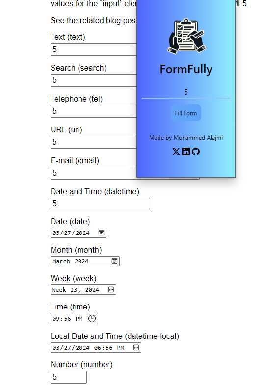

#  
       
FormFully
  

# FormFully Extension

## Overview
Automatically Auto fill in input fields with any value you want to save your precious time

##  Features
- Auto fill in input fields with any value you want
- If you leave the value empty, it will auto fill in with the random value from 1 to 5
- it can set any date input so it will set the date to the current date

##  Way to install the extension
- [Chrome web store](https://chromewebstore.google.com/detail/formfully/ojlpggfkjhgadcjdmkgdmpilhmnghlmj?hl=en&authuser=0).
- [Edge add-ons](https://chromewebstore.google.com/detail/formfully/ojlpggfkjhgadcjdmkgdmpilhmnghlmj?hl=en&authuser=0).
- Cloning the repo and then uploading the folder to the browser by enabling developer mode.

##  How to Use

1.  **Installation**: Simply clone the repo or download it as zip folder and then unzip it after that go to extensions page in your browser and enable developer option and then upload the folder make sure it is unzipped.

2.  **Usage**: After installing the extension, you will see the icon in the top right corner of the browser, click on it and then you will see the popup with the input fields, fill in the values you want to auto fill in and then click on the fill form button, now you can see the values are filled into the form.

## Some pictures of the extension

##  the extension under MIT License
