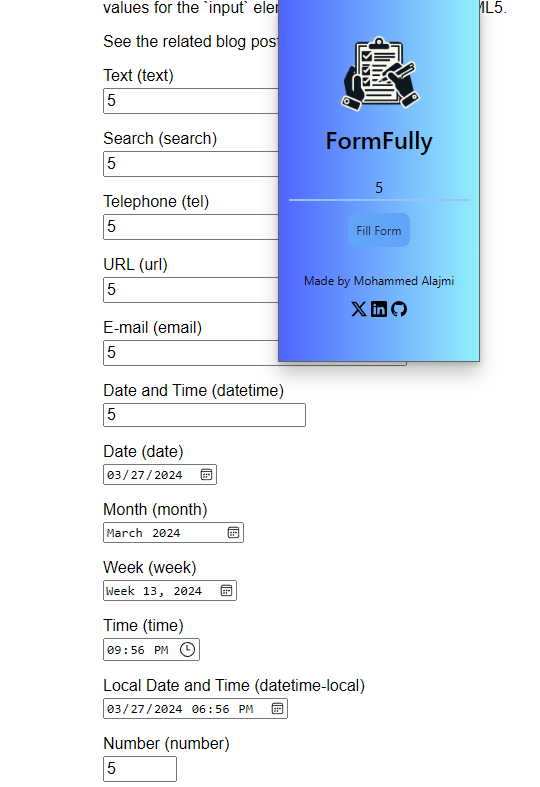

<div align="center">
	
	<h1>FormFully</h1>
	<p><em>Instant, intelligent, bilingual form filling.</em></p>
	<a href="https://formfully.mohammed-alajmi.me/" target="_blank">Website</a>
	·
	<a href="https://chromewebstore.google.com/detail/formfully/ojlpggfkjhgadcjdmkgdmpilhmnghlmj" target="_blank">Chrome Web Store</a>
	·
	<a href="https://microsoftedge.microsoft.com/addons/detail/formfully/giahhadiaaljamhigkeggghcadfnofce" target="_blank">Edge Add‑ons</a>
	·
	<a href="https://buymeacoffee.com/devm7mdali" target="_blank">Support</a>
</div>

---

## Overview
FormFully is a lightweight browser extension that saves you time while testing or completing web forms. Version 2.1 adds two deliberately separate modes:

- **Classic** is the original FormFully behavior and remains the default, so existing users and workflows continue to work unchanged.
- **Smart** is an opt-in, profile-aware filler for Google Forms and general web forms. It understands names, email, phone, company, address, common field types, textareas, selects, and accessible choice controls.

Website: [formfully.mohammed-alajmi.me](https://formfully.mohammed-alajmi.me/)

## ✨ Features
- Backward-compatible Classic mode with the original one-value workflow
- Opt-in Smart mode for Google Forms and general web forms
- Saved custom field rules such as `Group number → 12`, with the most specific matching rule taking priority
- Smart matching for full/first/last name, email, phone, company, address, city, country, URL, job title, and more
- Support for inputs, textareas, native selects, contenteditable fields, radio groups, checkbox questions, and accessible custom controls
- Framework-compatible `input` and `change` events for React and other controlled form libraries
- Safe defaults: Smart mode preserves existing values and skips passwords, files, payment/security fields, consent, marketing, and submission buttons
- Leave the Classic value blank to auto‑generate random numbers (1–5) per input
- Classic mode randomly selects one option in each unanswered radio group
- Field aware formatting:
	- `date`, `month`, `week`, `time`, `datetime-local`
	- `color` gets a random hex
- Bilingual UI: English + Arabic with full RTL support & instant switching
- Persistent value stored in browser-local extension storage (shared across popup & shortcut)
- Global keyboard shortcut: `Alt + Shift + F` on Windows/Linux or `Option + Shift + F` on macOS (customizable)
- Accessible glassmorphism UI with semantic focus styles
- Smart week number (ISO week) & date/time generation
- Lightweight: pure JS + Tailwind build (no heavy frameworks)
- Buy Me A Coffee support link integrated

## ⌨️ Keyboard Shortcut
Default: `Alt + Shift + F` on Windows/Linux and `Option + Shift + F` on macOS.

The legacy `fill-form-alt` command ID remains registered because browsers retain shortcut assignments by command ID across updates. Removing it would silently break Option + Shift + F for existing macOS users. You can customize the shortcut in your browser's extension shortcut settings. In Chrome and Edge, open `chrome://extensions/shortcuts`; in Firefox, use **Manage Extension Shortcuts** from `about:addons`.

The popup’s shortcut modal also lists platform specific guidance.

## 🌐 Languages
| Language | Status | Direction |
|----------|--------|-----------|
| English  | ✅     | LTR       |
| العربية  | ✅     | RTL       |

Language preference is remembered (localStorage) and updates immediately with correct direction & typography.

## 🧠 How It Chooses Values

### Classic mode

Classic mode intentionally keeps the established behavior:

| Input Type | Strategy |
|------------|----------|
| text / number (with user value) | Use your provided value |
| text / number (blank) | Random integer 1–5 |
| date | Today (YYYY-MM-DD) |
| month | Current month (YYYY-MM) |
| week | ISO week format (YYYY-Www) |
| time | Current time (HH:MM) |
| datetime / datetime-local | Current ISO slice (YYYY-MM-DDTHH:MM) |
| color | Random hex `#RRGGBB` |

Classic mode also preserves the existing `a_next` click behavior for compatible legacy workflows.

### Smart mode

Smart mode uses field type, `autocomplete`, name/id, placeholder, ARIA attributes, associated labels, nearby question text, and English/Arabic keywords. Profile details are saved locally. Any blank profile item receives a safe demo value, while generic questions use the optional “Default answer.”

For uncommon fields, add a custom rule using the field’s visible label or a distinctive keyword and the value to fill. Rules are saved locally and override the built-in Smart guess. They also select matching options in supported dropdown, radio, and checkbox questions.

Smart mode never submits the form or moves to the next page. Existing answers are preserved.

## 🚀 Installation
### From Stores
* Chrome: [Install](https://chromewebstore.google.com/detail/formfully/ojlpggfkjhgadcjdmkgdmpilhmnghlmj)
* Edge: [Install](https://microsoftedge.microsoft.com/addons/detail/formfully/giahhadiaaljamhigkeggghcadfnofce)

### Manual (Dev Mode)

Launch an isolated development browser with the extension already loaded:

```bash
pnpm dev:extension          # Chrome (default)
pnpm dev:extension:chrome
pnpm dev:extension:firefox
```

The launchers build the correct target and use a temporary browser profile, so they do not modify your normal Chrome or Firefox profile. Stop the development browser with `Ctrl+C`.

To load the extension into an existing browser profile manually:

1. Clone the repository
2. Run `pnpm install`
3. Run `pnpm build:extension`
4. Load the browser-specific output:
   - Chrome or Edge: enable Developer Mode at `chrome://extensions`, choose **Load unpacked**, and select `apps/extension/dist/chrome`.
   - Firefox: open `about:debugging#/runtime/this-firefox`, choose **Load Temporary Add-on**, and select `apps/extension/dist/firefox/manifest.json`.
   - Safari: run `xcrun safari-web-extension-converter apps/extension/dist/safari --macos-only`, then build the generated project in Xcode.

## 🧪 Usage
1. Click the FormFully icon to open the popup
2. Keep **Classic** selected for the original one-value behavior, or select **Smart**
3. In Classic, enter a value or leave it blank for random values
4. In Smart, optionally add your name, email, phone, company, and other details
5. Press the fill button or use `Alt + Shift + F`

The keyboard shortcut uses whichever mode is currently selected.

## 📸 Screenshot
<div align="center">
	
</div>

## 🔐 Permissions & Privacy
| Permission | Why |
|------------|-----|
| `activeTab` | Inject fill script into the current page when requested |
| `scripting` | Execute the fill function safely (MV3 requirement) |
| `storage` | Persist the selected mode, Classic value, optional Smart profile, and custom field rules |

Privacy: No data leaves your browser. There are no network requests, analytics, or trackers inside the extension. Classic values, Smart profile details, and custom rules stay in the browser's local extension storage on the device.

## 🧩 Tech Stack
* Manifest V3 for Chrome, Edge, Firefox, and Safari
* Strict TypeScript compiled to framework-free JavaScript
* TailwindCSS (utility + a few custom component classes)
* i18n via a lightweight typed in-repo dictionary
* React, Vite, and TypeScript for the landing page
* pnpm workspaces with one repository lockfile

## 🗂️ Repository Structure

```text
apps/
  extension/      Browser extension source, tests, manifest, and build output
  landing-page/   React landing page and hosting configuration
tooling/
  extension/      Multi-browser build, manifest, and packaging tools
  release/        Chrome and Edge publishing clients
  tests/          Release automation tests
docs/             Maintainer documentation
```

Common commands:

| Command | Purpose |
| --- | --- |
| `pnpm install` | Install the entire workspace from one lockfile |
| `pnpm dev:extension` | Build and launch FormFully in an isolated Chrome profile |
| `pnpm dev:extension:firefox` | Build and launch FormFully in an isolated Firefox profile |
| `pnpm typecheck` | Strictly type-check both apps and release tooling |
| `pnpm test` | Build the extension and run all behavior/automation tests |
| `pnpm build` | Build the extension and landing page |
| `pnpm package:extension` | Create versioned Chrome, Firefox, and Safari ZIPs plus checksums |
| `pnpm lint:firefox` | Validate the Firefox build with Mozilla's add-on linter |
| `pnpm check` | Run the same full verification and packaging gate used by CI |

## 🤝 Contributing
1. Fork & create a feature branch
2. Make changes (keep UI lightweight & performant)
3. Update README / i18n if adding user‑visible text
4. Open a PR describing rationale & screenshots (EN + AR if visual)

Ideas welcome: configurable presets, per‑domain profiles, side panel, options page for advanced patterns.

## 🌍 Browser Builds

`apps/extension/manifest.base.json` contains the shared Manifest V3 metadata. The build adds only the engine-specific background and compatibility keys, producing:

| Target | Development build | Release package |
| --- | --- | --- |
| Chrome and Edge | `apps/extension/dist/chrome` | `artifacts/formfully-chrome-<version>.zip` |
| Firefox | `apps/extension/dist/firefox` | `artifacts/formfully-firefox-<version>.zip` |
| Safari | `apps/extension/dist/safari` | `artifacts/formfully-safari-<version>.zip` |

Firefox and Safari use event-page background scripts, while Chrome and Edge use a service worker. Runtime API calls prefer the standard promise-based `browser` namespace and fall back to Chromium's `chrome` namespace.

## 📦 Store Releases

Every successful `main` verification evaluates conventional commits for a semantic release. The first release preserves the manifest version; later `fix:` commits create patch releases, `feat:` commits create minor releases, and `BREAKING CHANGE:` creates a major release. Each GitHub Release includes checksummed ZIPs for Chrome/Edge, Firefox, and Safari.

Chrome Web Store and Microsoft Edge Add-ons publishing remains a separate workflow. For a release created by CI, start **Publish browser extension** manually and select the store; manually pushed tags must exactly match the manifest version, such as `v2.3.0`.

Every branch and pull request runs commit validation plus the same verification pipeline and exposes the three ZIPs as workflow artifacts. Landing-page deployment waits for a successful `Verify` run on `main` and deploys the exact commit that passed.

Maintainer setup, required secrets, release steps, retry controls, and safety behavior are documented in [Browser store release automation](./docs/store-release.md).

## 🗒️ Changelog (Highlights)
| Version | Summary |
|---------|---------|
| 2.2.0 | Added saved Smart custom-field rules and random Classic radio-group selection |
| 2.1.0 | Added opt-in Smart mode for Google Forms and general forms; Classic remains the default and unchanged |
| 2.0.2 | Shortcut modal (platform specific), simplified command, footer size tweak |
| 2.0.1 | Added keyboard shortcut, background service worker, storage migration |
| 2.0.0 | Major redesign: glass UI, Arabic support (RTL), presets, i18n extraction, donation button |
| 1.x   | Initial minimal popup & basic fill logic |

## ☕ Support
If FormFully saves you time, consider supporting: [Buy me a coffee](https://buymeacoffee.com/devm7mdali)

## 📝 License
MIT — see [LICENSE](./LICENSE).

---
Made by [Mohammed Alajmi](https://devm7mdali.github.io) with care for testers, QA, and builders.
